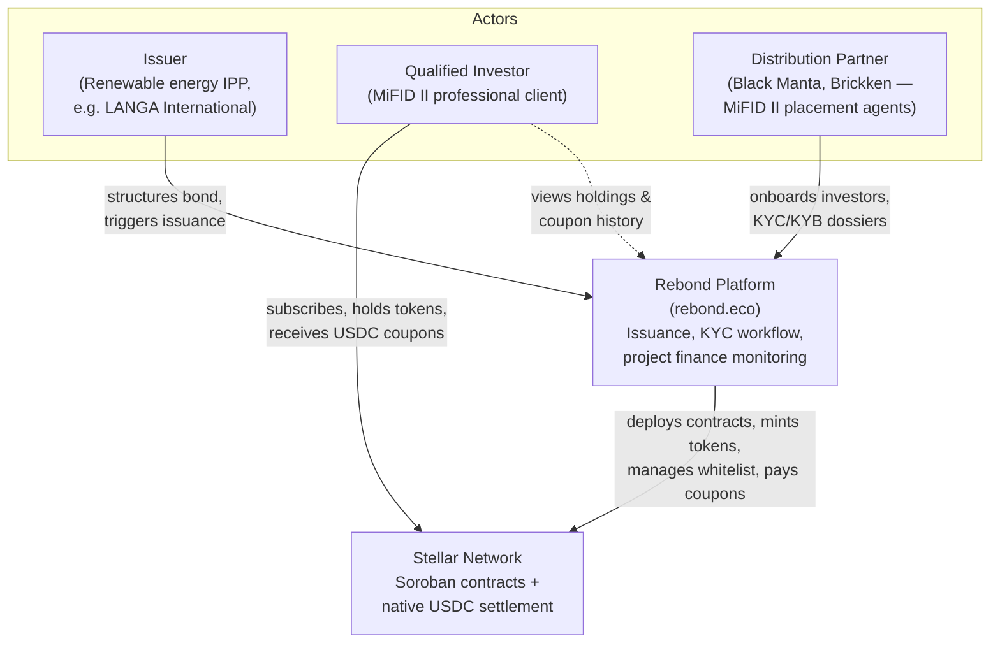
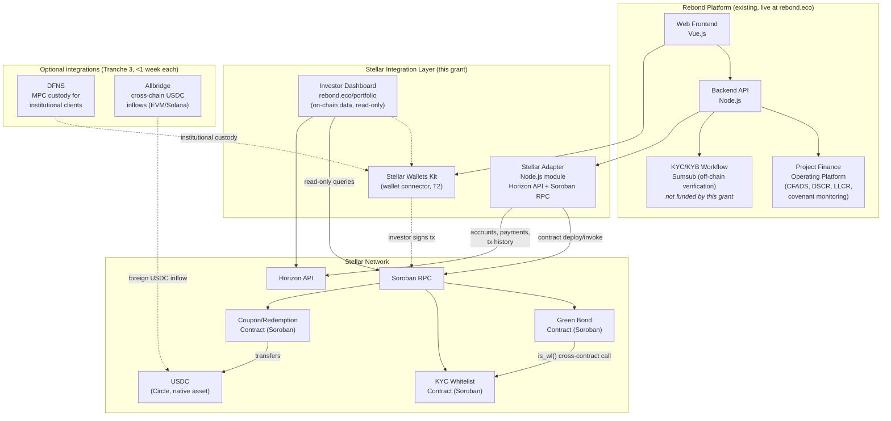
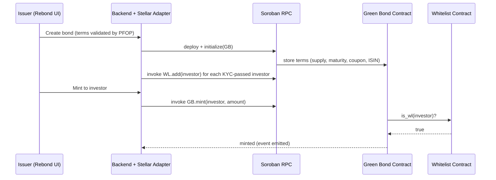
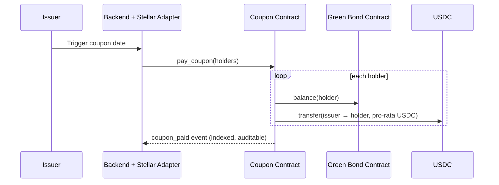

# Technical Architecture — Rebond Green Bond Tokenization on Stellar

> **Project:** Rebond — compliant green bond tokenization for European renewable energy IPPs
> **Network:** Stellar (Soroban smart contracts)
> **Status:** Contracts deployed and initialized on **Stellar testnet** (June 2026) — see [Testnet Deployments](#7-testnet-deployments)
> **Repository:** https://github.com/RenewableEnergyBond/soroban-green-bond

This document follows the C4 model: system context (L1), containers (L2), components (L3), plus runtime flows and Stellar integration points.

---

## 1. System Context (C4 Level 1)

**Problem solved:** mid-market European IPPs (€5–30M green debt deals) are excluded from traditional bond issuance due to fixed costs (€150–300K in arranging, listing and paying-agent fees per deal). Rebond replaces this with Soroban contracts and native USDC settlement at near-zero marginal cost.

**Regulatory frame:** French *placement privé* (Art. L.411-2 CMF), MiFID II security tokens, qualified investors only — enforced **on-chain** by the KYC whitelist contract.

---

## 2. Containers (C4 Level 2)

| Container | Technology | Status | Grant scope |
|---|---|---|---|
| Web Frontend | Vue.js | Live (multi-chain) | — |
| Backend API | Node.js | Live | — |
| Project Finance Operating Platform | Node.js | Live at rebond.eco | — |
| KYC/KYB Workflow | **Sumsub** (off-chain) | Live | — *(not funded by this grant)* |
| **Stellar Adapter** | Node.js (Horizon + Soroban RPC) | Planned (Tranche 1) | ✅ |
| **Stellar Wallets Kit** | JS wallet connector | Planned (Tranche 2) | ✅ (light) |
| **Green Bond Contract** | Rust / Soroban SDK 22 | **Deployed on testnet** | ✅ |
| **KYC Whitelist Contract** | Rust / Soroban SDK 22 | **Deployed on testnet** | ✅ |
| **Coupon/Redemption Contract** | Rust / Soroban SDK 22 | **Deployed on testnet** (scaffold; full logic in Tranche 2) | ✅ |
| **Investor Dashboard** | Vue.js | Planned (Tranche 2) | ✅ |
| DFNS (MPC custody) | Stellar Integration List | Optional (Tranche 3) | ✅ (light, &lt;1 week) |
| Allbridge (cross-chain USDC) | Stellar Integration List | Optional (Tranche 3) | ✅ (light, &lt;1 week) |

---

## 3. Components — Soroban Contracts (C4 Level 3)

### 3.1 Green Bond Contract ([contracts/green-bond](contracts/green-bond))

Core MiFID II security token. All bond parameters are immutably stored on-chain at initialization.

| Function | Auth | Description |
|---|---|---|
| `initialize(issuer, total_supply, maturity_timestamp, coupon_rate_bps, isin, whitelist_contract)` | once | Stores bond terms; links the KYC whitelist contract |
| `mint(to, amount)` | issuer | Issues tokens up to `total_supply` cap; recipient must be whitelisted |
| `transfer(from, to, amount)` | holder | KYC-enforced transfer — **both** parties must be whitelisted |
| `balance(owner)` | read | Token balance |
| `get_bond_info()` | read | Full bond terms (issuer, supply, maturity, coupon, ISIN, whitelist) |

**Compliance enforcement:** every `mint` and `transfer` performs a **cross-contract call** to the whitelist contract (`is_wl(address)`). A non-whitelisted address can never hold or receive tokens — compliance is a contract-level invariant, not a backend policy.

### 3.2 KYC Whitelist Contract ([contracts/kyc-whitelist](contracts/kyc-whitelist))

On-chain registry of MiFID II-verified investor addresses. Fed by Rebond's off-chain KYC/KYB workflow — powered by **Sumsub** (identity verification, AML screening, KYB for legal entities) — via the Stellar Adapter. Sumsub is an existing part of Rebond's platform OPEX and is **not funded by this grant**.

| Function | Auth | Description |
|---|---|---|
| `initialize(admin)` | once | Sets registry admin |
| `add(address)` / `remove(address)` | admin | Whitelist management |
| `is_wl(address) → bool` | read | Called cross-contract by the Green Bond contract |
| `transfer_admin(new_admin)` | admin | Admin rotation |
| `whitelist_count()` | read | Number of verified addresses |

### 3.3 Coupon/Redemption Contract ([contracts/coupon-redemption](contracts/coupon-redemption))

Automates the bond lifecycle payments in **native USDC**. Deployed as a scaffold; full payout logic is Tranche 2 scope.

| Function | Auth | Description |
|---|---|---|
| `initialize(issuer, bond_contract, usdc_token)` | once | Links bond contract and USDC asset |
| `pay_coupon(holders)` | issuer | Pro-rata USDC coupon distribution to all whitelisted holders (Tranche 2) |
| `redeem(holder)` | issuer | Principal redemption at maturity in USDC (Tranche 2) |

---

## 4. Runtime Flows

### 4.1 Bond issuance

### 4.2 Coupon payment (Tranche 2)

### 4.3 Investor view

Investor dashboard (rebond.eco/portfolio) reads **directly from the chain** (Soroban RPC simulation calls + Horizon transaction history) — holdings, upcoming coupons, payment history, explorer links. No trust in Rebond's database required for bond data.

---

## 5. Stellar Integration Points

### 5.1 Core (funded by this grant)

| Stellar component | Usage | Tranche |
|---|---|---|
| **Soroban smart contracts** (Rust, SDK 22) | 3 contracts: security token, compliance registry, lifecycle payments | T1–T2 |
| **Native USDC** (Circle) | Coupon and principal settlement — replaces paying-agent banking rails | T2–T3 |
| **Soroban RPC** | Contract deployment, invocations, read-only simulations (dashboard) | T1–T3 |
| **Horizon API** | Account management, USDC payment submission, transaction history | T1–T3 |
| **Stellar Wallets Kit** | Investor wallet connection on the dashboard (multi-wallet: Freighter, Albedo, LOBSTR, xBull) | T2 |
| **Events + indexing** | All state changes emit events (`bond_initialized`, `wl_initialized`, `coupon_paid`, …) for audit trail and explorer visibility | T1–T3 |

### 5.2 Stellar Integration List components

Items from the official Stellar Integration List that Rebond integrates or plans to integrate. Each optional item is a **light integration (&lt;1 week)** and is sized accordingly in the budget — they are not standalone milestones.

| Integration List item | Role for Rebond | Status |
|---|---|---|
| **Stellar Wallets Kit** | Primary multi-wallet connector for qualified-retail investors (Freighter, Albedo, LOBSTR, xBull) | Core — Tranche 2 |
| **DFNS** | Optional MPC custody for institutional clients and family offices without a browser wallet | Optional — Tranche 3 |
| **Allbridge** | Optional cross-chain USDC inflows from EVM/Solana for foreign accredited investors | Optional — Tranche 3 |

**Why Stellar:** ~$0.00001 per transaction and 5s finality make per-holder coupon distribution economically viable at any deal size; native USDC removes banking intermediaries from settlement; the network is regulatory-neutral for EU issuers (bond tokens are MiFID II financial instruments, out of MiCA scope).

---

## 6. Security & Compliance Model

- **On-chain enforcement:** transfer restrictions live in the contract, not the backend. The whitelist invariant holds even if Rebond's platform is offline or compromised.
- **Role separation:** issuer (mint, coupon triggers), whitelist admin (KYC registry), holders (transfers). Admin rotation supported.
- **Supply cap:** `total_supply` immutable after initialization; `mint` enforces the cap (overflow-checked arithmetic, `overflow-checks = true` in release profile).
- **Auditability:** every lifecycle action emits an event; full history reconstructable from chain data alone.
- **Audit plan:** external audit of all three contracts before mainnet (Tranche 3 gate), via Stellar LaunchKit — **not funded by this grant**.
- **KYC/KYB vendor:** Sumsub (identity verification, AML, KYB) — part of Rebond platform OPEX, **not funded by this grant**.
- **CI:** every push runs the full test suite (15 unit tests), `clippy --all-targets -D warnings`, `rustfmt`, and a release WASM build ([.github/workflows/ci.yml](.github/workflows/ci.yml)).

---

## 7. Testnet Deployments

Deployed and initialized on Stellar testnet, **10 June 2026** (deployer `GBX3MIAPKVCMK5BJB4FQTADGYMDW7OBOTZXAME3WR4VL4FMADWGTVZO2`):

| Contract | Contract ID |
|---|---|
| KYC Whitelist | [`CAZQL5DAN3MYX5QEIS3EVDEBN2S5AVYJE23EYBTW4L7C5XMJAOIXKL3J`](https://stellar.expert/explorer/testnet/contract/CAZQL5DAN3MYX5QEIS3EVDEBN2S5AVYJE23EYBTW4L7C5XMJAOIXKL3J) |
| Green Bond | [`CB53OFE56JSBHHM4R7J4MU32LJL5F6OG5V7JRAXPL72MN3U44RZBEGS7`](https://stellar.expert/explorer/testnet/contract/CB53OFE56JSBHHM4R7J4MU32LJL5F6OG5V7JRAXPL72MN3U44RZBEGS7) |
| Coupon/Redemption | [`CCN4YGOLXHQCWE6YTH4X5Q76YBHDHZQQPWCZ2Y5HTVRKIOERFNOEOQM7`](https://stellar.expert/explorer/testnet/contract/CCN4YGOLXHQCWE6YTH4X5Q76YBHDHZQQPWCZ2Y5HTVRKIOERFNOEOQM7) |

Live bond on testnet: ISIN-equivalent `FRRBD00001`, 1,000,000 tokens (1 token = €1), 5.00% coupon (500 bps), KYC whitelist enforced on every transfer.

---

## 8. Delivery Roadmap (SCF Build tranches)

| Tranche | Scope | Key architecture milestones |
|---|---|---|
| **T1 — MVP** (M1-2) | Green Bond contract, KYC Whitelist, Stellar Adapter | Contracts hardened + full test coverage; backend can deploy/initialize/mint from Rebond UI |
| **T2 — Testnet** (M3-4) | USDC coupon/redemption logic, investor onboarding (Stellar Wallets Kit), dashboard | End-to-end testnet demo: issuance → whitelist → coupon → redemption, with explorer links |
| **T3 — Mainnet** (M5-6) | Audit remediation, mainnet deploy, first live issuance, optional DFNS + Allbridge | First real bond (~€1M, LANGA International), first on-chain coupon, open-source release |

### 8.1 Tranche 3 target metrics

Quantified success targets for the mainnet tranche (verifiable on Stellar Expert):

| Metric | Target |
|---|---|
| First live issuance (TVL on the bond contract) | **≥ €1,000,000** (LANGA International pilot) |
| Qualified investor wallets onboarded on mainnet | **≥ 3** (via Stellar Wallets Kit / DFNS) |
| On-chain settlement transactions (issuance + first coupon cycle) | **≥ 10** |
| Coupon distribution | **1 full multi-recipient USDC coupon** executed on mainnet |
| Contracts open-sourced (MIT) | **3 / 3** (Green Bond, KYC Whitelist, Coupon/Redemption) |
